# 내 컴퓨터에 개발자용 작업실 꾸미기

## 0. 프로젝트 개요

이 프로젝트는 터미널, Docker, Git/GitHub를 활용하여 재현 가능한 로컬 개발 환경을 구성하는 것을 목표로 한다.

터미널을 이용하여 작업 디렉토리와 파일 권한을 관리하고, OrbStack과 Docker를 이용하여 컨테이너 기반 웹 서버를 실행했다. 또한 포트 매핑, 바인드 마운트, Docker 볼륨을 직접 검증하고 전체 수행 과정과 결과를 GitHub 저장소에 기록했다.

## 1. 수행항목 체크리스트

- [x] 과제 전용 작업 디렉토리 생성
- [x] Git 저장소 초기화 및 main 브랜치 설정
- [x] 터미널을 이용한 파일 및 디렉토리 생성
- [x] 파일 복사, 이동, 이름 변경 및 삭제
- [x] 파일과 디렉토리 권한 확인
- [x] chmod를 이용한 권한 변경
- [x] OrbStack 설치 및 Docker 실행 환경 구성
- [x] Docker 버전과 실행 경로 확인
- [x] hello-world 이미지 다운로드 및 컨테이너 실행
- [x] Docker 이미지와 컨테이너의 차이 확인
- [x] Ubuntu 대화형 컨테이너 실행
- [x] 컨테이너 내부 Linux 환경 확인
- [x] 정적 웹페이지 작성
- [x] Dockerfile 작성
- [x] 커스텀 Docker 이미지 빌드
- [x] Nginx 컨테이너 실행
- [x] 8080 포트 매핑 및 웹 접속 확인
- [x] 8081 포트 매핑 및 다중 컨테이너 실행 확인
- [x] 바인드 마운트를 이용한 HTML 변경 즉시 반영
- [x] Docker 볼륨 생성
- [x] 컨테이너 삭제 후 볼륨 데이터 유지 확인
- [x] 바인드 마운트와 Docker 볼륨 비교
- [x] Docker 컨테이너 상태 확인
- [x] Docker 컨테이너 로그 확인
- [x] Docker 컨테이너 리소스 사용량 확인
- [x] Docker 컨테이너 중지 및 재시작
- [x] Git add 및 commit 수행
- [x] GitHub 원격 저장소 연결
- [x] GitHub push 수행
- [x] 수행 결과 스크린샷 저장
- [x] GitHub push 403 오류 트러블슈팅 작성
- [x] 절대 경로와 상대 경로의 차이 정리
- [x] Git 사용자 이름과 이메일 설정
- [x] Git 기본 브랜치를 `main`으로 설정
- [x] `git config --list` 결과 기록
- [x] `docker attach` 동작 확인
- [x] `docker exec` 동작 확인
- [x] `attach`와 `exec` 종료 영향 비교
- [x] OrbStack 설치 후 터미널 재실행 트러블슈팅 작성

## 2. 실행 환경

- OS: macOS
- Shell: zsh
- Terminal: macOS Terminal
- Container Runtime: OrbStack
- Docker: 28.5.2
- Git: 2.53.0

## 3. 작업공간 생성

과제 전용 디렉토리를 생성하고 Git 저장소를 초기화했다.

```bash
mkdir -p ~/codyssey
cd ~/codyssey
mkdir codyssey-E1-1-workstation
cd codyssey-E1-1-workstation
git init
git branch -M main
```

현재 작업 경로:

```text
/Users/heoyulan/codyssey/codyssey-E1-1-workstation
```

### 수행 결과

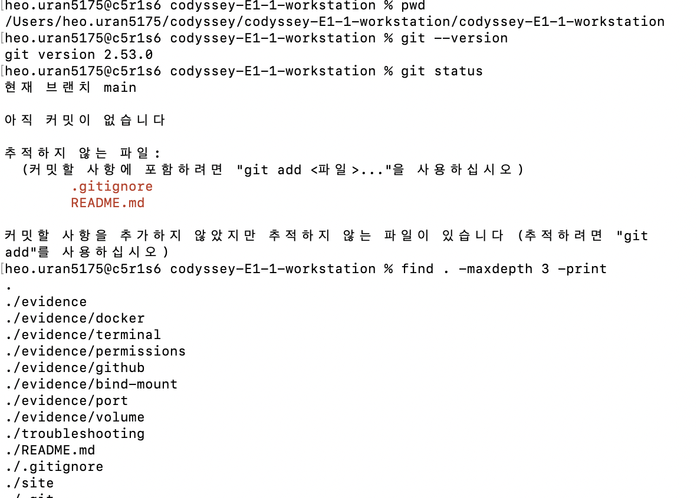

## 4. 터미널 기본 조작

터미널에서 디렉토리와 파일을 생성하고 파일의 복사, 이동, 이름 변경 및 삭제 작업을 수행했다.

### 사용한 명령어

```bash
mkdir -p terminal-practice/source
cd terminal-practice
touch source/sample.txt
echo "Codyssey terminal practice" > source/sample.txt
cat source/sample.txt
cp source/sample.txt source/sample-copy.txt
mv source/sample-copy.txt source/renamed.txt
rm source/renamed.txt
mkdir delete-test
rmdir delete-test
ls -la
```

### 명령어 설명

- `pwd`: 현재 작업 경로를 확인한다.
- `mkdir`: 디렉토리를 생성한다.
- `cd`: 디렉토리를 이동한다.
- `touch`: 빈 파일을 생성한다.
- `echo`: 문자열을 출력하거나 파일에 저장한다.
- `cat`: 파일의 내용을 확인한다.
- `cp`: 파일을 복사한다.
- `mv`: 파일을 이동하거나 이름을 변경한다.
- `rm`: 파일을 삭제한다.
- `rmdir`: 비어 있는 디렉토리를 삭제한다.
- `ls -la`: 숨김 파일과 권한을 포함한 목록을 확인한다.

### 수행 결과

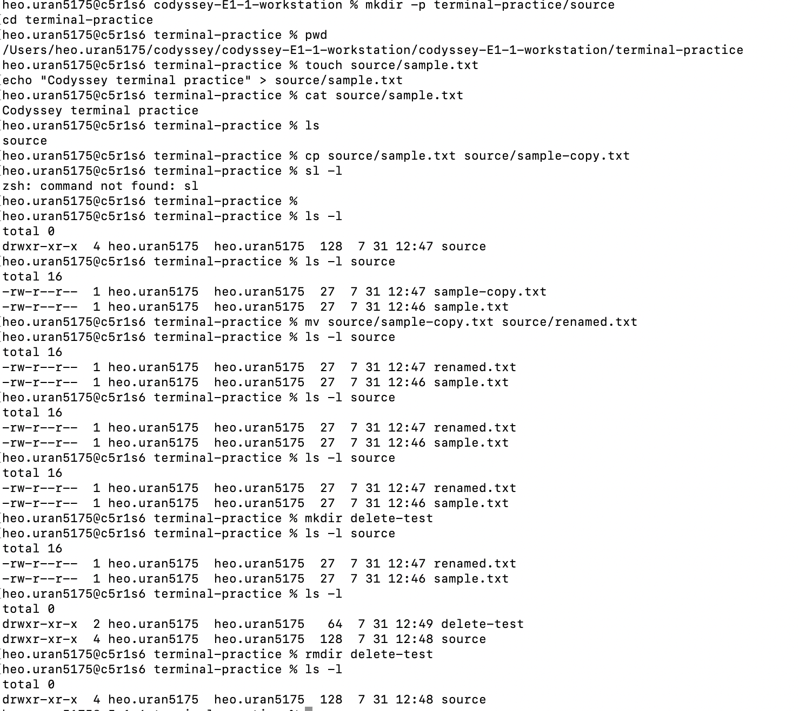

### 절대 경로와 상대 경로

절대 경로는 파일 시스템의 최상위 위치부터 대상 파일까지 전체 경로를 표현한다.

```text
/Users/heo.uran5175/codyssey/codyssey-E1-1-workstation/site/index.html
```

현재 디렉토리와 관계없이 항상 같은 위치를 가리킨다.

상대 경로는 현재 작업 디렉토리를 기준으로 파일 위치를 표현한다.

현재 위치가 프로젝트 루트라면 다음 경로는:

```text
site/index.html
```

현재 디렉토리 아래의 `site` 폴더에 있는 `index.html`을 의미한다.

- `.`: 현재 디렉토리
- `..`: 상위 디렉토리
- `./site/index.html`: 현재 디렉토리를 기준으로 한 파일


## 5. 파일 및 디렉토리 권한

파일과 디렉토리의 권한을 확인하고 `chmod` 명령으로 권한을 변경했다.

### 실행 명령어

```bash
mkdir -p permission-practice/test-directory
touch permission-practice/test-file.sh
ls -ld permission-practice/test-directory
ls -l permission-practice/test-file.sh

chmod 700 permission-practice/test-directory
chmod 600 permission-practice/test-file.sh

ls -ld permission-practice/test-directory
ls -l permission-practice/test-file.sh

```

### 권한 설명

- `r`: 읽기 권한
- `w`: 쓰기 권한
- `x`: 실행 권한 또는 디렉토리 접근 권한

숫자 권한은 다음 값을 더하여 표현한다.

- `r = 4`
- `w = 2`
- `x = 1`

따라서 다음과 같이 해석할 수 있다.

- `755` = `rwxr-xr-x`
- `644` = `rw-r--r--`
- `700` = `rwx------`
- `600` = `rw-------`

### 수행 결과

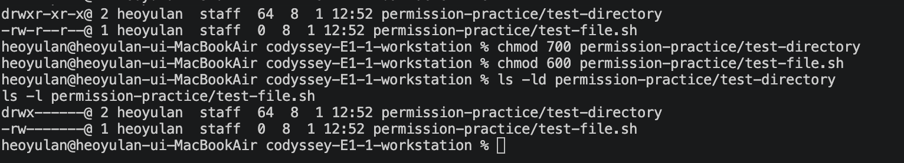

## 6. Docker 설치 및 기본 점검

OrbStack을 실행하고 Docker CLI 경로를 설정한 뒤 Docker 엔진의 동작을 확인했다.

### Docker 버전 확인

```bash
docker --version
docker info
```

확인 결과:

```text
Docker version 28.5.2, build ecc6942

```

### hello-world 실행

```bash
docker run --name hello-codyssey hello-world
docker ps -a
docker images
docker logs hello-codyssey
```

`docker run --name hello-codyssey hello-world` 명령은 로컬에 `hello-world` 이미지가 있는지 먼저 확인한다.

로컬에 이미지가 없으면 Docker Hub에서 이미지를 내려받고, 해당 이미지로 `hello-codyssey` 컨테이너를 생성하여 실행한다.

`hello-world` 컨테이너는 안내 메시지를 출력한 후 종료되므로 `Exited (0)` 상태가 정상이다.

### 이미지와 컨테이너의 차이

- 이미지는 컨테이너 실행에 필요한 파일과 설정을 담은 템플릿이다.
- 컨테이너는 이미지를 기반으로 생성되어 실제 실행되는 인스턴스이다.
- 하나의 이미지로 여러 개의 컨테이너를 생성할 수 있다.

### 수행 결과

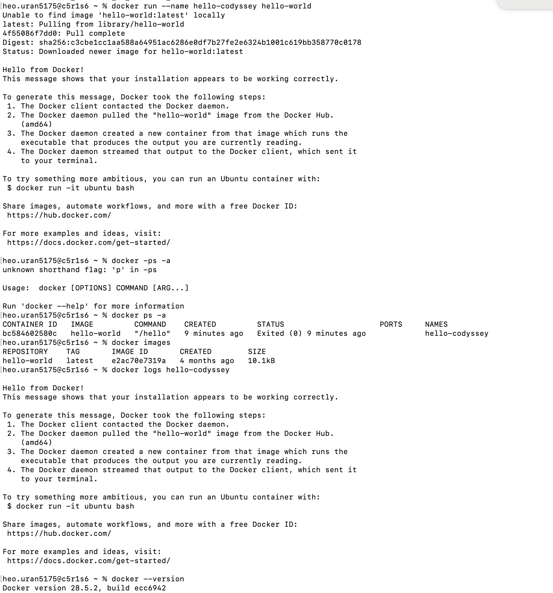

## 7. Ubuntu 컨테이너 실습

Ubuntu 이미지를 이용하여 대화형 컨테이너를 생성하고 내부 Linux 환경을 확인했다.

### 컨테이너 실행

```bash
docker run -it --name ubuntu-practice ubuntu bash
```

옵션의 의미는 다음과 같다.

- `docker run`: 컨테이너를 생성하고 실행한다.
- `-it`: 터미널 입력을 받을 수 있는 대화형 모드로 실행한다.
- `--name ubuntu-practice`: 컨테이너 이름을 지정한다.
- `ubuntu`: 사용할 이미지이다.
- `bash`: 컨테이너 내부에서 실행할 프로그램이다.

### 컨테이너 내부 확인

```bash
pwd
ls -la
cat /etc/os-release
whoami
echo "inside ubuntu container"
```

`whoami` 결과로 `root`가 출력되었고, `/etc/os-release`를 통해 Ubuntu 환경임을 확인했다.

컨테이너 내부에서 다음 명령으로 종료했다.

```bash
exit
```

`bash`가 컨테이너의 주 프로세스이므로 `exit`로 해당 프로세스가 종료되면 컨테이너도 중지된다.

중지된 컨테이너는 다음 명령으로 다시 실행할 수 있다.

```bash
docker start -ai ubuntu-practice
```

### 수행 결과

Ubuntu 컨테이너 실습 결과 PNG는 아직 추가되지 않았다.

## 8. 웹페이지와 Dockerfile 작성

Nginx 정적 웹서버를 사용하기 위해 `site/index.html`과 `Dockerfile`을 작성했다. 

### 프로젝트 파일

```text
Dockerfile
site/index.html
```

### Dockerfile

```dockerfile
FROM nginx:alpine

LABEL org.opencontainers.image.title="codyssey-workstation"

ENV APP_ENV=dev

COPY site/ /usr/share/nginx/html/

EXPOSE 80
```

### Dockerfile 명령 설명

- `FROM nginx:alpine`: Nginx가 포함된 가벼운 Alpine 기반 이미지를 사용한다.
- `LABEL`: 이미지의 설명용 메타정보를 추가한다.
- `ENV APP_ENV=dev`: 컨테이너에서 사용할 환경변수를 설정한다.
- `COPY`: 로컬 `site` 폴더를 이미지 내부의 Nginx 웹 루트로 복사한다.
- `EXPOSE 80`: 컨테이너가 80번 포트를 사용한다는 정보를 기록한다.

`EXPOSE 80`만으로 호스트에서 접속할 수 있는 것은 아니다. 실제 포트 연결은 컨테이너 실행 시 `-p` 옵션으로 설정한다.

## 9. 커스텀 Docker 이미지 빌드

작성한 Dockerfile을 이용하여 Nginx 기반 커스텀 이미지를 생성했다.

### 빌드 명령어

```bash
docker build -t codyssey-web:1.0 .
```

- `docker build`: Dockerfile을 이용해 이미지를 생성한다.
- `-t codyssey-web:1.0`: 이미지 이름을 `codyssey-web`, 태그를 `1.0`으로 지정한다.
- `.`: 현재 디렉토리를 빌드 컨텍스트로 사용한다.

이미지 생성 여부는 다음 명령으로 확인했다.

```bash
docker images
```

### 수행 결과

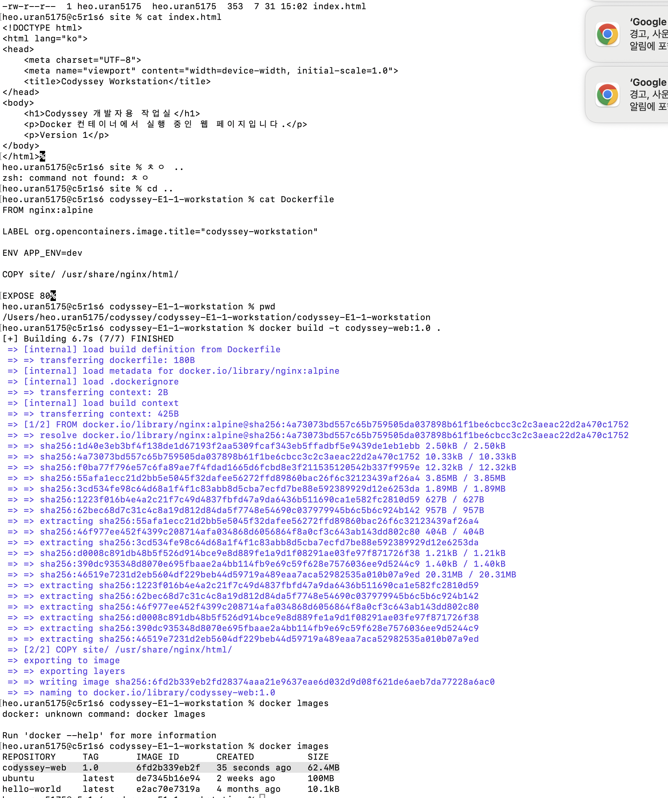

## 10. 포트 매핑과 웹 접속

커스텀 이미지를 이용하여 두 개의 Nginx 컨테이너를 실행했다.

### 8080 포트 실행

```bash
docker run -d \
  --name codyssey-web-8080 \
  -p 8080:80 \
  codyssey-web:1.0
```

### 8081 포트 실행

```bash
docker run -d \
  --name codyssey-web-8081 \
  -p 8081:80 \
  codyssey-web:1.0
```

`-p 8080:80`은 호스트 macOS의 8080 포트를 컨테이너 내부 Nginx의 80 포트에 연결한다는 뜻이다.

컨테이너는 격리된 네트워크에서 실행되므로 외부 브라우저에서 접근하려면 호스트 포트와 컨테이너 포트를 연결해야 한다.

동일한 `codyssey-web:1.0` 이미지로 이름과 호스트 포트가 서로 다른 두 개의 컨테이너를 실행할 수 있음을 확인했다.

### 터미널 및 브라우저 확인

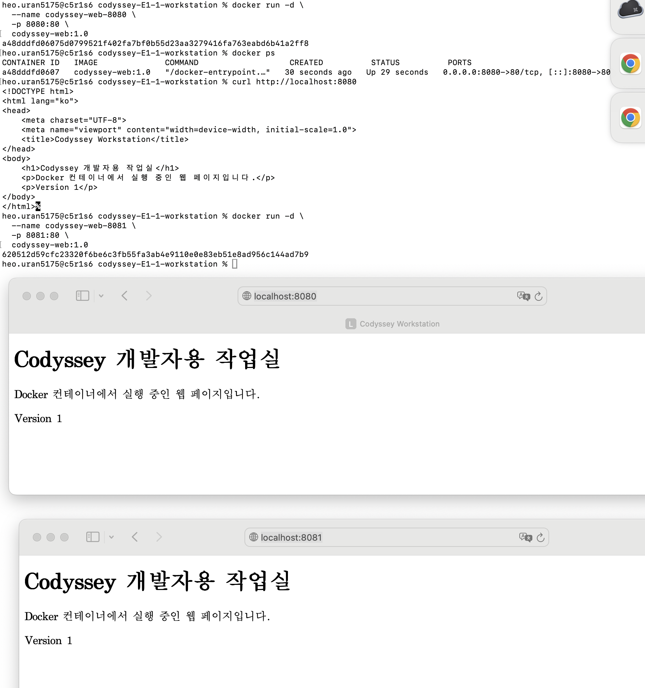

## 11. 바인드 마운트 변경 반영

호스트의 `site` 디렉토리를 Nginx 컨테이너의 웹 루트에 바인드 마운트했다.

### 실행 명령어

```bash
docker run -d \
  --name codyssey-bind \
  -p 8082:80 \
  -v "$(pwd)/site:/usr/share/nginx/html:ro" \
  nginx:alpine
```

`$(pwd)/site`는 호스트의 실제 디렉토리이며, `/usr/share/nginx/html`은 컨테이너 내부 Nginx의 웹 루트이다.

호스트의 `site/index.html`을 `Version 1`에서 `Version 2`로 수정했다. Docker 이미지를 다시 빌드하거나 컨테이너를 재시작하지 않았지만 브라우저를 새로고침하자 변경 내용이 즉시 반영되었다.

### 변경 결과

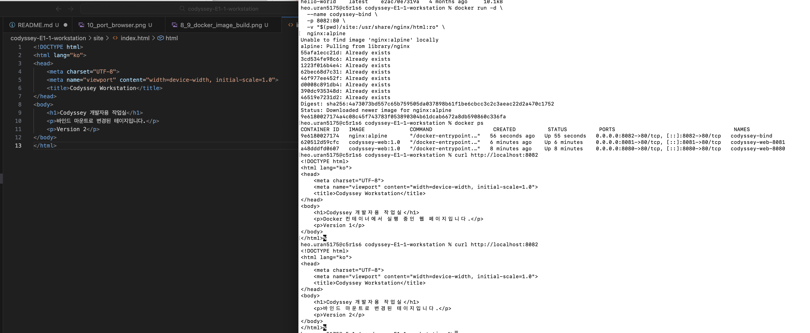

## 12. Docker 볼륨과 데이터 영속성

Docker가 관리하는 `codyssey-data` 볼륨을 생성하고 컨테이너의 `/data` 디렉토리에 연결했다.

### 볼륨 생성

```bash
docker volume create codyssey-data
docker volume ls
```

### 첫 번째 컨테이너에 데이터 생성

```bash
docker run -d \
  --name volume-test-1 \
  -v codyssey-data:/data \
  ubuntu sleep infinity

docker exec volume-test-1 \
  bash -lc 'echo "Codyssey persistent data" > /data/hello.txt'

docker exec volume-test-1 cat /data/hello.txt
```

### 컨테이너 삭제 후 데이터 확인

```bash
docker rm -f volume-test-1

docker run -d \
  --name volume-test-2 \
  -v codyssey-data:/data \
  ubuntu sleep infinity

docker exec volume-test-2 cat /data/hello.txt
```

첫 번째 컨테이너를 삭제한 뒤 같은 볼륨을 새 컨테이너에 연결했으며, `/data/hello.txt`의 내용이 그대로 유지되는 것을 확인했다.

컨테이너와 Docker 볼륨의 생명주기는 서로 분리되어 있기 때문에 컨테이너를 삭제해도 볼륨을 삭제하지 않으면 데이터가 유지된다.

### 컨테이너 삭제 전후

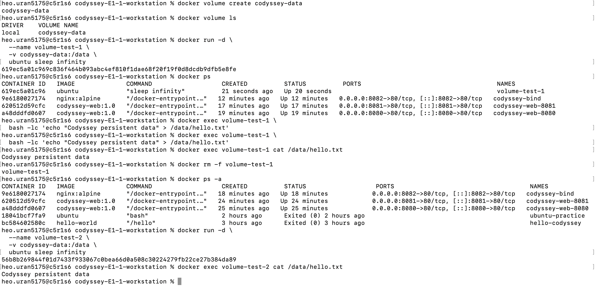

### 바인드 마운트와 Docker 볼륨 비교

| 구분 | 바인드 마운트 | Docker 볼륨 |
|---|---|---|
| 저장 위치 | 사용자가 지정한 호스트 경로 | Docker가 관리하는 경로 |
| 주요 용도 | 개발 파일 즉시 반영 | 데이터 영속성 |
| 호스트 접근 | 직접 접근하기 쉬움 | Docker 명령으로 관리 |
| 이번 검증 | HTML 수정 즉시 반영 | 컨테이너 삭제 후 데이터 유지 |

## 13. Git 및 GitHub 연동

로컬 프로젝트를 Git 저장소로 관리하고 GitHub 원격 저장소와 연결했다.

### Git 저장소 초기화

```bash
git init
git branch -M main
```

### 파일 커밋

```bash
git add .
git commit -m "feat: complete developer workstation mission"
```

`git add`로 변경 파일을 스테이징하고 `git commit`으로 해당 시점의 변경 이력을 저장했다.

### GitHub 원격 저장소 연결

```bash
git remote add origin https://github.com/thoroki/codyssey-E1-1-workstation.git
git push -u origin main
```

`origin`이라는 이름으로 GitHub 원격 저장소를 등록하고 로컬 `main` 브랜치를 GitHub에 업로드했다.

### Git과 GitHub의 차이

- Git은 로컬 컴퓨터에서 파일 변경 이력을 관리하는 버전 관리 도구이다.
- GitHub는 Git 저장소를 원격으로 보관하고 공유 및 협업할 수 있는 서비스이다.


heo.uran5175@c5r1s6 codyssey-E1-1-workstation % git config --list
credential.helper=osxkeychain
user.name=thoroki
user.email=heo.uran@gmail.com
init.defaultbranch=main
core.repositoryformatversion=0
core.filemode=true
core.bare=false
core.logallrefupdates=true
core.ignorecase=true
core.precomposeunicode=true
remote.origin.url=https://github.com/thoroki/codyssey-E1-1-workstation.git
remote.origin.fetch=+refs/heads/*:refs/remotes/origin/*
branch.main.remote=origin
branch.main.merge=refs/heads/main


### 수행 결과

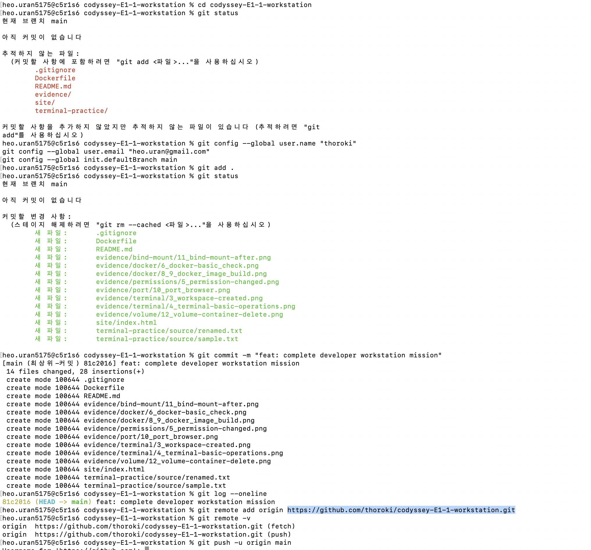

## 14. Docker 컨테이너 운영

실행 중인 컨테이너의 상태, 로그와 리소스 사용량을 확인하고 컨테이너를 중지한 뒤 다시 시작했다.

### 상태 확인

```bash
docker ps
docker ps -a
```

- `docker ps`: 실행 중인 컨테이너를 확인한다.
- `docker ps -a`: 종료된 컨테이너를 포함한 전체 컨테이너를 확인한다.

### 로그 및 리소스 확인

```bash
docker logs codyssey-web-8080
docker stats --no-stream
```

### 중지 및 재시작

```bash
docker stop codyssey-web-8080
docker ps -a
docker start codyssey-web-8080
docker ps
curl http://localhost:8080
```

컨테이너를 중지한 뒤 다시 시작했고 웹페이지가 정상적으로 응답하는 것을 확인했다.

### 수행 결과

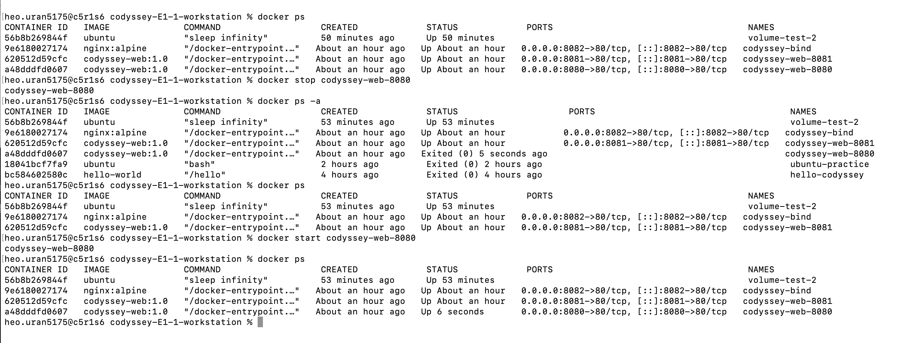


### 15. 컨테이너 종료와 유지: attach와 exec 비교

컨테이너의 유지 여부가 터미널 접속 상태가 아니라 컨테이너의 주 프로세스 실행 여부에 따라 달라지는 것을 확인했다.

#### attach 실습

먼저 `bash`를 주 프로세스로 사용하는 Ubuntu 컨테이너를 실행했다.

```bash
docker run -it --name attach-practice ubuntu bash
```


컨테이너를 종료했다가 start 하였다 
```

호스트에서 상태를 확인했다.

```bash
docker ps
```

`attach-practice` 컨테이너가 계속 `Up` 상태로 유지되는 것을 확인했다.

다시 컨테이너의 기존 주 프로세스에 연결했다.

```bash
docker attach attach-practice
```

`docker attach`는 새로운 프로세스를 생성하지 않고, 컨테이너에서 이미 실행 중인 주 프로세스의 입력과 출력에 연결한다.

컨테이너 내부에서 다음 명령을 실행했다.

```bash
echo "attach practice"
```

attach 상태에서 다음 명령을 실행했다.

```bash
exit
```

이 경우 주 프로세스인 `bash`가 종료되므로 컨테이너도 함께 종료되었다.

```bash
docker ps -a
```
### 수행 결과

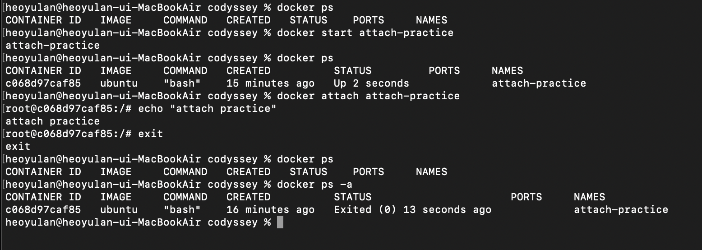


#### exec 실습

비교를 위해 계속 실행되는 프로세스를 가진 컨테이너를 생성했다.

```bash
docker run -d \
  --name exec-practice \
  ubuntu sleep infinity
```

실행 중인 컨테이너에서 새로운 `bash` 프로세스를 실행했다.

```bash
docker exec -it exec-practice bash
```

컨테이너 내부에서 다음 명령을 실행했다.

```bash
echo "exec practice"
exit
```

`docker exec`로 실행한 `bash`에서 빠져나왔지만, 컨테이너의 주 프로세스인 `sleep infinity`는 계속 실행 중이므로 컨테이너는 종료되지 않았다.

```bash
docker ps
```

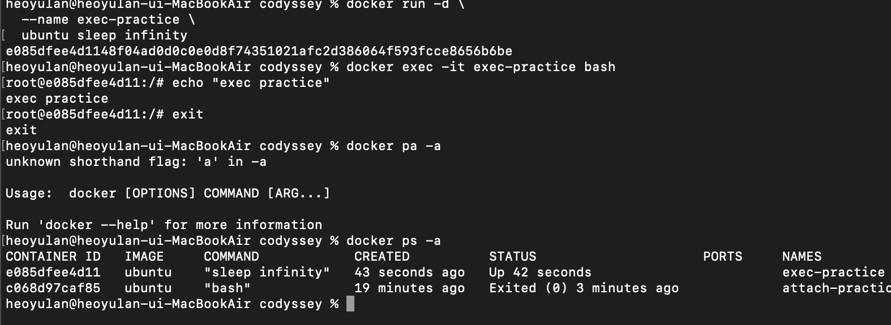

#### attach와 exec 비교

| 구분 | `docker attach` | `docker exec` |
|---|---|---|
| 연결 방식 | 실행 중인 주 프로세스에 연결 | 컨테이너 안에서 새 프로세스 실행 |
| 새 프로세스 생성 | 하지 않음 | 생성함 |
| `exit` 영향 | 주 프로세스가 종료되면 컨테이너도 종료 | 추가 프로세스만 종료되며 컨테이너는 유지 가능 |
| 주요 용도 | 기존 주 프로세스 화면에 다시 접속 | 실행 중인 컨테이너 내부 점검 및 명령 실행 |

#### 관찰 결과

- `docker attach`로 연결한 상태에서 `exit`하면 주 프로세스인 `bash`가 종료되어 컨테이너도 종료되었다.
- `docker exec`로 실행한 추가 `bash`에서 `exit`해도 주 프로세스가 살아 있으면 컨테이너는 계속 유지되었다.
- 컨테이너의 종료 여부는 접속을 끊었는지가 아니라 주 프로세스가 종료되었는지에 따라 결정된다.


## 16. 트러블슈팅

### 16.1 OrbStack 설치 후 docker 명령을 찾지 못한 문제

#### 문제

OrbStack을 설치하고 실행한 뒤 기존 터미널에서 Docker 버전을 확인했으나 다음 오류가 발생했다.

```text
zsh: command not found: docker
```

#### 원인

OrbStack 설치는 정상적으로 완료되었지만, 설치 전에 열려 있던 터미널을 계속 사용하고 있었다.

기존 터미널 세션에는 OrbStack 설치 후 변경된 환경 설정과 Docker CLI 경로가 아직 반영되지 않아 `docker` 명령을 찾지 못했다.

#### 확인

OrbStack이 정상적으로 실행 중인지 확인한 뒤 새 터미널 창을 열었다.

새 터미널에서 다음 명령을 실행했다.

```bash
docker --version
which docker
```

#### 해결

기존 터미널을 종료하고 새로운 터미널을 실행했다.

새 터미널 세션에서는 OrbStack 설치 과정에서 설정된 Docker CLI 경로가 정상적으로 반영되었다.

별도의 Docker 재설치나 컨테이너 재시작은 필요하지 않았다.

#### 결과

```text
Docker version 28.5.2, build ecc6942
/Users/heo.uran5175/.orbstack/bin/docker
```

`docker` 명령이 정상적으로 인식되었고 Docker 버전과 실행 경로를 확인할 수 있었다.

#### 정리

프로그램 설치 과정에서 환경변수나 실행 경로가 변경되더라도 이미 열려 있는 터미널에는 즉시 반영되지 않을 수 있다.

이 경우 기존 터미널을 종료하고 새 터미널을 실행하면 변경된 환경 설정이 적용된다.


### 16.2 GitHub push 시 403 오류 발생

#### 문제

다음 명령으로 GitHub 원격 저장소에 push를 시도했다.

```bash
git push -u origin main
```

다음 오류가 발생했다.

```text
fatal: unable to access
'https://github.com/thoroki/codyssey-E1-1-workstation.git/':
The requested URL returned error: 403
```

#### 원인 가설

원격 저장소 주소는 정상적으로 등록되어 있었으므로 GitHub 인증에 사용한 Personal Access Token에 저장소 쓰기 권한이 없는 것으로 판단했다.

#### 확인

```bash
git remote -v
```

원격 주소가 대상 GitHub 저장소를 가리키는 것을 확인했다.

Fine-grained token 설정에서는 다음 상태였다.

- Resource owner: `thoroki`
- Repository access: `Only select repositories`
- 선택 저장소: `thoroki/codyssey-E1-1-workstation`
- Repository permissions: 미설정

#### 해결

Fine-grained token 화면에서 필요한 쓰기 권한을 설정할 수 없어 Personal Access Token classic을 생성했다.

그다음 새로운 토큰을 사용하여 push를 다시 실행했다.


```bash
git push -u origin main
```

#### 결과

GitHub 원격 저장소에 정상적으로 push되었으며 로컬 브랜치와 `origin/main`이 동기화되었다.

```text
main -> main
브랜치가 'origin/main'에 맞게 업데이트된 상태입니다.
커밋할 사항 없음, 작업 폴더 깨끗함
```

#### 정리

GitHub에서 HTTPS 방식으로 push할 때는 계정 비밀번호가 아니라 Personal Access Token을 사용해야 한다. 또한 해당 토큰에는 대상 저장소에 대한 쓰기 권한이 있어야 한다.


## 17. Docker Compose 기초: 단일 서비스 실행

기존에는 `docker run` 명령으로 컨테이너의 이름, 포트, 이미지 등을 직접 지정했다.

Docker Compose에서는 이러한 실행 설정을 `docker-compose.yml` 파일에 기록하여 동일한 환경을 반복해서 실행할 수 있도록 구성했다.

### 17.1 docker-compose.yml 작성

프로젝트 루트에 다음 구조로 `docker-compose.yml` 파일을 작성했다.

```yaml
services:
  web:
    build:
      context: .
      dockerfile: Dockerfile
    container_name: codyssey-compose-web
    ports:
      - "8083:80"
```

### 17.2 Compose 파일 구조 설명

- `services`: Compose로 관리할 서비스 목록을 정의한다.
- `web`: 서비스 이름이다.
- `build`: Docker 이미지를 빌드할 방법을 정의한다.
- `context: .`: 현재 디렉토리를 빌드 컨텍스트로 사용한다.
- `dockerfile: Dockerfile`: 사용할 Dockerfile을 지정한다.
- `container_name`: 생성할 컨테이너 이름을 지정한다.
- `ports`: 호스트 포트와 컨테이너 포트를 연결한다.
- `"8083:80"`: 호스트의 8083 포트를 컨테이너 내부 80 포트에 연결한다.

### 17.3 단일 서비스 실행

다음 명령으로 Compose에 정의된 웹 서비스를 백그라운드에서 실행했다.

```bash
docker compose up -d
```

- `up`: Compose 파일에 정의된 서비스를 생성하고 실행한다.
- `-d`: 터미널을 점유하지 않고 백그라운드에서 실행한다.

### 17.4 서비스 상태 확인

```bash
docker compose ps
```

`codyssey-compose-web` 컨테이너가 실행 중인 상태임을 확인했다.

### 17.7 웹페이지 접속 확인

터미널에서 웹페이지 응답을 확인했다.

```bash
curl http://localhost:8083
```

### 17.8 docker run과 Docker Compose 비교

기존 `docker run` 방식에서는 실행할 때마다 컨테이너 이름, 포트, 이미지 등의 옵션을 직접 입력해야 한다.

```bash
docker run -d \
  --name codyssey-compose-web \
  -p 8083:80 \
  codyssey-web:1.0
```

Docker Compose에서는 동일한 설정을 `docker-compose.yml`에 문서화하고 다음 명령으로 실행할 수 있다.

```bash
docker compose up -d
```

| 구분 | docker run | Docker Compose |
|---|---|---|
| 설정 위치 | 터미널 명령어 | YAML 파일 |
| 반복 실행 | 긴 옵션을 다시 입력 | 같은 설정 파일 재사용 |
| 공유 | 명령어를 별도로 전달 | Compose 파일로 공유 |
| 변경 관리 | 명령어 수정 필요 | YAML 설정 수정 |
| 주요 용도 | 간단한 단일 컨테이너 실행 | 여러 실행 설정의 문서화와 관리 |

### 관찰 결과

- 컨테이너 실행 설정이 터미널 명령어에서 `docker-compose.yml` 파일로 옮겨졌다.
- 실행 설정이 파일로 남기 때문에 동일한 환경을 반복해서 구성할 수 있다.
- 다른 사용자가 저장소를 내려받아도 같은 Compose 파일을 사용하여 동일한 서비스를 실행할 수 있다.
- `docker compose config`를 사용하면 실제로 적용될 설정과 YAML 문법 오류를 확인할 수 있다.
- `docker compose ps`와 `docker compose logs`를 통해 Compose 단위로 컨테이너 상태와 로그를 관리할 수 있다.

### 수행 결과

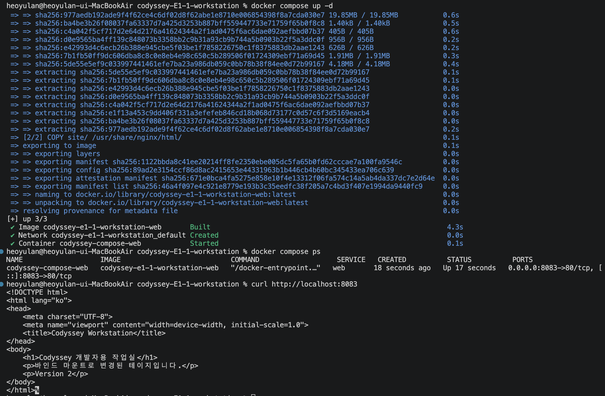


## 18. Docker Compose 멀티 컨테이너 구성

기존 단일 웹 서비스 구성에 보조 서비스인 `helper`를 추가하여 두 개의 컨테이너를 Docker Compose로 함께 실행했다.

이번 실습에서는 Compose가 자동으로 생성하는 기본 네트워크를 통해 컨테이너가 서로 서비스 이름으로 통신할 수 있는지 확인했다.

### 18.1 docker-compose.yml 수정

기존 `web` 서비스에 `helper` 서비스를 추가했다.

```yaml
services:
  web:
    build:
      context: .
      dockerfile: Dockerfile
    container_name: codyssey-compose-web
    ports:
      - "8083:80"

  helper:
    image: curlimages/curl:latest
    container_name: codyssey-compose-helper
    command: ["sleep", "infinity"]
```

### 18.2 서비스 구성 설명

#### web 서비스

`web` 서비스는 기존 Dockerfile을 이용하여 Nginx 기반 커스텀 이미지를 빌드하고 실행한다.

```yaml
web:
  build:
    context: .
    dockerfile: Dockerfile
```

호스트의 8083 포트를 컨테이너 내부의 80 포트에 연결했다.

```yaml
ports:
  - "8083:80"
```

#### helper 서비스

`helper` 서비스는 `curl` 명령을 사용할 수 있는 보조 컨테이너이다.

```yaml
helper:
  image: curlimages/curl:latest
```

다음 설정으로 컨테이너가 바로 종료되지 않고 실행 상태를 유지하도록 했다.

```yaml
command: ["sleep", "infinity"]
```

### 18.3 멀티 컨테이너 실행

변경된 Compose 설정을 적용하여 두 서비스를 함께 실행했다.

```bash
docker compose up -d
```

Compose는 `web`과 `helper` 서비스를 생성하고 동일한 기본 네트워크에 연결했다.

### 18.4 서비스 상태 확인

```bash
docker compose ps
```

다음 두 서비스가 모두 실행 중인지 확인했다.

- `web`
- `helper`

실제 컨테이너 이름은 다음과 같다.

```text
codyssey-compose-web
codyssey-compose-helper
```

### 18.5 컨테이너 간 통신 확인

`helper` 컨테이너 내부에서 `web` 서비스로 HTTP 요청을 전송했다.

```bash
docker compose exec helper curl http://web
```

`web`은 IP 주소가 아니라 `docker-compose.yml`에 정의한 서비스 이름이다.

요청 결과로 `site/index.html`의 HTML 내용이 출력되어 두 컨테이너 사이의 네트워크 통신이 정상적으로 이루어지는 것을 확인했다.

### 18.6 서비스 디스커버리

Docker Compose는 같은 Compose 프로젝트의 서비스들을 기본 네트워크에 연결한다.

같은 네트워크에 연결된 컨테이너는 상대 컨테이너의 IP 주소를 직접 알지 않아도 서비스 이름으로 접근할 수 있다.

```text
http://web
```

이처럼 서비스 이름을 네트워크 주소처럼 사용하는 기능을 서비스 디스커버리라고 한다.

컨테이너의 IP 주소는 재생성 과정에서 변경될 수 있지만 서비스 이름은 Compose 파일에 정의된 값으로 유지되므로, 컨테이너 간 통신에는 IP 주소보다 서비스 이름을 사용하는 것이 적합하다.

### 18.7 호스트와 컨테이너 내부 접근 방식 비교

macOS 호스트에서는 공개된 호스트 포트를 이용하여 웹 서비스에 접근했다.

```bash
curl http://localhost:8083
```

Compose 내부의 `helper` 컨테이너에서는 서비스 이름과 컨테이너 포트를 이용했다.

```bash
docker compose exec helper curl http://web:80
```

| 실행 위치 | 접근 주소 | 사용 포트 |
|---|---|---|
| macOS 호스트 | `http://localhost:8083` | 호스트 포트 8083 |
| helper 컨테이너 | `http://web:80` | 컨테이너 포트 80 |

호스트에서는 포트 매핑을 이용하지만 같은 Compose 네트워크 내부의 컨테이너끼리는 호스트 포트를 거치지 않고 컨테이너 포트로 직접 통신한다.

### 18.8 Compose 기본 네트워크 확인

Docker 네트워크 목록을 확인했다.

```bash
docker network ls
```

Compose 프로젝트에서 사용하는 네트워크 설정도 확인했다.

```bash
docker compose config --networks
```

별도의 네트워크 설정을 작성하지 않았지만 Compose가 프로젝트 전용 기본 네트워크를 자동으로 생성하고 두 서비스를 해당 네트워크에 연결한 것을 확인했다.

### 관찰 결과

- 하나의 `docker-compose.yml`에서 두 개 이상의 서비스를 함께 실행할 수 있었다.
- `web`과 `helper` 컨테이너가 Compose 기본 네트워크에 자동으로 연결되었다.
- `helper` 컨테이너에서 IP 주소 없이 `web`이라는 서비스 이름으로 Nginx에 접근할 수 있었다.
- 호스트에서는 `localhost:8083`, 컨테이너 내부에서는 `web:80`으로 접근해야 한다는 차이를 확인했다.
- 컨테이너 IP가 변경될 수 있으므로 컨테이너 간 통신에는 서비스 이름을 사용하는 것이 적합하다.

### 수행 결과

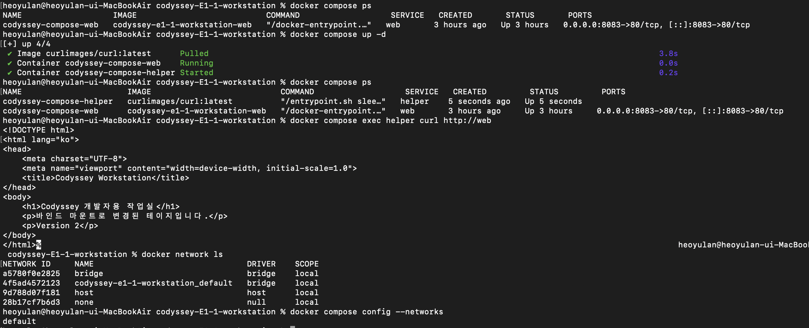

## 19. Docker Compose 운영 명령어

Docker Compose로 실행한 서비스를 운영 관점에서 관리하기 위해 `up`, `ps`, `logs`, `down` 명령을 사용했다.

이번 실습에서는 서비스를 실행하고, 상태와 로그를 확인한 뒤 종료하고 다시 실행하는 기본 운영 흐름을 확인했다.

### 19.1 서비스 상태 확인

현재 Compose 프로젝트의 서비스 상태를 확인했다.

```bash
docker compose ps
```

`web`과 `helper` 서비스가 모두 실행 중인지 확인했다.

- `docker compose ps`: 현재 Compose 프로젝트에 속한 서비스와 컨테이너 상태를 확인한다.
- `running` 또는 `Up`: 컨테이너가 실행 중인 상태이다.
- 아무 항목도 표시되지 않으면 현재 실행 중인 Compose 서비스가 없는 상태이다.

### 19.2 전체 로그 확인

Compose 프로젝트의 전체 서비스 로그를 확인했다.

```bash
docker compose logs
```

특정 서비스의 로그만 확인하려면 서비스 이름을 지정했다.

```bash
docker compose logs web
```

최근 로그 일부만 확인했다.

```bash
docker compose logs --tail 20 web
```

`--tail 20`은 최근 로그 20줄만 출력한다.

### 19.3 실시간 로그 확인

웹 서비스의 로그를 실시간으로 확인했다.

```bash
docker compose logs -f web
```


### 19.4 서비스 종료 및 삭제

Compose 프로젝트의 컨테이너와 기본 네트워크를 종료하고 삭제했다.

```bash
docker compose down
```

`docker compose down`은 다음 항목을 정리한다.

- Compose로 생성한 서비스 컨테이너
- Compose가 생성한 기본 네트워크

기본 설정에서는 Docker 이미지와 이름 있는 볼륨은 삭제하지 않는다.

종료 후 서비스 상태를 확인했다.

```bash
docker compose ps
```

아무 서비스도 표시되지 않아 Compose 컨테이너가 삭제된 것을 확인했다.

Docker 네트워크 목록도 확인했다.

```bash
docker network ls
```

기존에 존재하던 다음 Compose 기본 네트워크가 삭제된 것을 확인했다.

```text
codyssey-e1-1-workstation_default
```

### 19.5 서비스 다시 실행

종료한 서비스를 다시 백그라운드에서 실행했다.

```bash
docker compose up -d
```

서비스 상태를 확인했다.

```bash
docker compose ps
```

컨테이너 간 통신도 다시 확인했다.

```bash
docker compose exec helper curl http://web
```

웹페이지 HTML이 출력되어 `web`과 `helper` 서비스가 정상적으로 재생성되고 같은 네트워크에 연결된 것을 확인했다.

### 19.6 Compose 운영 명령 비교

| 명령어 | 역할 |
|---|---|
| `docker compose up -d` | 서비스를 생성하고 백그라운드에서 실행 |
| `docker compose ps` | 서비스와 컨테이너 상태 확인 |
| `docker compose logs` | 전체 서비스 로그 확인 |
| `docker compose logs web` | 특정 서비스 로그 확인 |
| `docker compose logs -f web` | 특정 서비스의 로그를 실시간 확인 |
| `docker compose down` | 서비스 컨테이너와 기본 네트워크 종료 및 삭제 |

### 19.7 상태 확인 루틴

Compose 서비스를 운영할 때 다음 순서로 상태를 점검할 수 있다.

```bash
docker compose ps
docker compose logs --tail 20
docker compose exec helper curl http://web
```

각 명령의 확인 목적은 다음과 같다.

1. `docker compose ps`로 컨테이너가 실행 중인지 확인한다.
2. `docker compose logs --tail 20`으로 최근 오류나 실행 로그를 확인한다.
3. `docker compose exec helper curl http://web`으로 실제 서비스 간 통신이 가능한지 확인한다.

문제가 발생하면 서비스별 로그를 추가로 확인한다.

```bash
docker compose logs web
docker compose logs helper
```

작업이 끝난 뒤에는 다음 명령으로 서비스를 정리한다.

```bash
docker compose down
```

### 관찰 결과

- `docker compose up -d`로 여러 서비스를 한 번에 실행할 수 있었다.
- `docker compose ps`로 현재 서비스 상태를 확인할 수 있었다.
- `docker compose logs`로 전체 또는 특정 서비스의 로그를 확인할 수 있었다.
- `docker compose logs -f`를 사용하여 웹 요청 로그가 실시간으로 출력되는 것을 확인했다.
- `docker compose down`을 실행하면 Compose 컨테이너와 기본 네트워크가 함께 삭제되었다.
- `docker compose up -d`를 다시 실행하면 동일한 설정으로 서비스와 네트워크가 재생성되었다.
- 상태 확인, 로그 확인, 통신 확인 순서로 Compose 서비스의 기본 점검 루틴을 구성할 수 있었다.

### 수행 결과

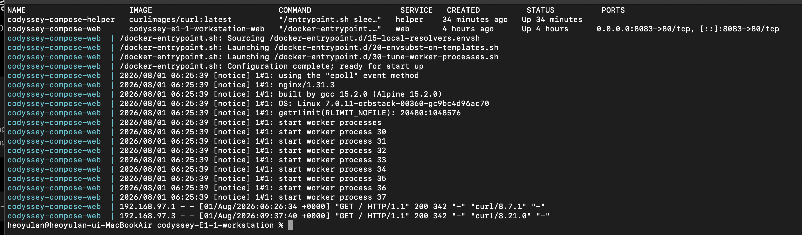

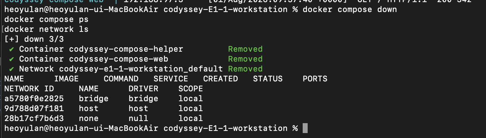


## 20. Docker Compose 환경 변수 활용

Docker Compose 파일에 포트와 실행 모드를 직접 고정하지 않고 `.env` 파일의 값을 사용하도록 구성했다.

이번 실습에서는 Compose 설정과 환경별 값을 분리하고, `.env` 파일의 값만 변경하여 웹 서비스의 호스트 포트와 컨테이너 내부 실행 모드를 바꿔보았다.

### 20.1 `.env` 파일 작성

프로젝트 루트에 `.env` 파일을 생성했다.

```env
WEB_PORT=8084
APP_ENV=development
```

각 변수의 의미는 다음과 같다.

- `WEB_PORT`: macOS 호스트에서 사용할 웹 서비스 포트
- `APP_ENV`: 컨테이너 내부에서 사용할 애플리케이션 실행 모드

### 20.2 `.gitignore` 설정

`.env` 파일에는 환경별 설정이나 민감정보가 포함될 수 있으므로 Git에 올라가지 않도록 `.gitignore`에 추가했다.

```gitignore
.env
```

저장소에는 실제 설정값 대신 예시 파일을 남길 수 있도록 `.env.example`을 작성했다.

```env
WEB_PORT=8084
APP_ENV=development
```

`.env.example`에는 비밀번호, 토큰 등 실제 민감정보를 넣지 않는다.

### 20.3 docker-compose.yml 수정

Compose 파일에서 포트와 실행 모드를 환경 변수로 받도록 수정했다.

```yaml
services:
  web:
    build:
      context: .
      dockerfile: Dockerfile
    container_name: codyssey-compose-web
    ports:
      - "${WEB_PORT}:80"
    environment:
      APP_ENV: "${APP_ENV}"

  helper:
    image: curlimages/curl:latest
    container_name: codyssey-compose-helper
    command: ["sleep", "infinity"]
```

### 20.4 환경 변수 적용 방식

다음 설정은 `.env`의 `WEB_PORT` 값을 Compose 포트 설정에 적용한다.

```yaml
ports:
  - "${WEB_PORT}:80"
```

`.env`에 다음 값이 있으면:

```env
WEB_PORT=8084
```

실제 적용되는 포트 매핑은 다음과 같다.

```text
호스트 8084 포트 → 컨테이너 80 포트
```

다음 설정은 `.env`의 `APP_ENV` 값을 컨테이너 내부 환경 변수로 주입한다.

```yaml
environment:
  APP_ENV: "${APP_ENV}"
```

`.env`의 값을 Compose 파일에 치환하는 것과 `environment`를 통해 컨테이너 내부로 값을 전달하는 것은 서로 다른 과정이다.

- `${WEB_PORT}`: Compose 설정값으로 사용
- `environment`: 컨테이너 내부 환경 변수로 전달

### 20.5 최종 적용 설정 확인

환경 변수가 적용된 최종 Compose 설정을 확인했다.

```bash
docker compose config
```

주요 확인 결과:

```yaml
environment:
  APP_ENV: development
ports:
  - mode: ingress
    target: 80
    published: "8084"
```


### 20.6 변경된 설정으로 서비스 재실행

기존 Compose 서비스를 종료하고 환경 변수가 적용된 설정으로 다시 실행했다.

```bash
docker compose down
docker compose up -d
```

상태를 확인했다.

```bash
docker compose ps
```

웹 서비스의 포트 매핑이 다음과 같이 변경된 것을 확인했다.

```text
0.0.0.0:8084->80/tcp
```

### 20.7 변경된 포트 접속 확인

터미널에서 변경된 포트로 웹페이지에 접속했다.

```bash
curl http://localhost:8084
```

브라우저에서도 다음 주소로 접속했다.

```text
http://localhost:8084
```

웹페이지가 정상적으로 표시되어 `.env`의 `WEB_PORT` 값이 Compose 설정에 반영된 것을 확인했다.

### 20.8 설정과 코드의 분리

환경 변수를 사용하면 Dockerfile이나 Compose 파일의 전체 구조를 수정하지 않고 환경별 값만 변경할 수 있다.

| 구분 | 직접 작성 방식 | 환경 변수 방식 |
|---|---|---|
| 포트 설정 | `8084:80`처럼 파일에 고정 | `${WEB_PORT}:80` 사용 |
| 실행 모드 | `development`를 직접 작성 | `${APP_ENV}` 사용 |
| 환경 변경 | Compose 파일 수정 | `.env` 값만 수정 |
| 저장소 관리 | 환경별 값이 설정 파일에 노출 | 실제 `.env`는 Git에서 제외 가능 |
| 재사용성 | 환경마다 파일 수정 필요 | 같은 Compose 파일 재사용 가능 |

### 관찰 결과

- `.env` 파일의 값을 `docker-compose.yml`에서 사용할 수 있었다.
- `.env`의 `WEB_PORT` 값이 호스트 포트 매핑에 반영되었다.
- `environment` 설정을 통해 `APP_ENV` 값이 컨테이너 내부에 전달되었다.
- `.env` 값만 변경하여 포트와 실행 모드를 바꿀 수 있었다.
### 수행 결과

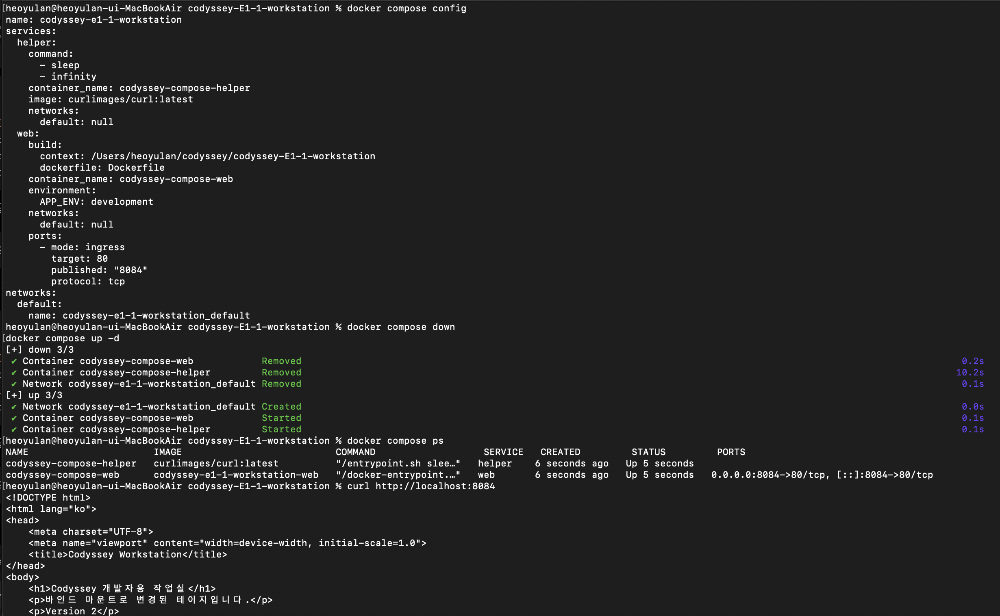


## 21. GitHub SSH 키 설정 및 SSH 방식 push

기존에는 HTTPS 주소와 Personal Access Token을 사용하여 GitHub에 push했다.

이번 실습에서는 SSH 키를 생성하고 공개 키를 GitHub 계정에 등록한 뒤, 원격 저장소 주소를 HTTPS에서 SSH 형식으로 변경하여 비밀번호나 토큰 입력 없이 push할 수 있도록 설정했다.

### 21.1 기존 SSH 키 확인

먼저 현재 사용자 계정에 SSH 키가 존재하는지 확인했다.

```bash
ls -al ~/.ssh
```

다음과 같은 파일이 있는지 확인했다.

```text
id_ed25519
id_ed25519.pub
```

- `id_ed25519`: 개인 키
- `id_ed25519.pub`: 공개 키

개인 키는 외부에 공개하거나 GitHub 저장소에 올리면 안 된다.

### 21.2 SSH 키 생성

기존 SSH 키가 없어서 Ed25519 방식의 새 SSH 키를 생성했다.

```bash
ssh-keygen -t ed25519 -C "GitHub 등록 이메일"
```

키 저장 위치는 기본 경로를 사용했다.

```text
~/.ssh/id_ed25519
```

생성된 파일은 다음과 같다.

```text
~/.ssh/id_ed25519
~/.ssh/id_ed25519.pub
```

### 21.3 SSH agent에 개인 키 등록

SSH agent를 실행했다.

```bash
eval "$(ssh-agent -s)"
```

macOS 키체인과 SSH agent에 개인 키를 등록했다.

```bash
ssh-add --apple-use-keychain ~/.ssh/id_ed25519
```

등록된 키를 확인했다.

```bash
ssh-add -l
```

확인 결과 SSH 키의 지문과 `ED25519` 형식이 출력되었다.

### 21.4 공개 키 복사

GitHub 계정에 등록하기 위해 공개 키를 클립보드에 복사했다.

```bash
pbcopy < ~/.ssh/id_ed25519.pub
```

공개 키 파일인 `id_ed25519.pub`만 GitHub에 등록했으며, 개인 키인 `id_ed25519`는 로컬 컴퓨터에만 보관했다.

### 21.5 GitHub에 공개 키 등록

GitHub에서 다음 메뉴로 이동했다.

```text
Settings
→ SSH and GPG keys
→ New SSH key
```

다음 항목을 입력했다.

```text
Title: heoyulan MacBook Air
Key type: Authentication Key
Key: id_ed25519.pub 공개 키 내용
```

공개 키 등록 후 GitHub 계정이 로컬 개인 키를 이용한 SSH 인증을 허용하도록 설정했다.

### 21.6 GitHub SSH 연결 테스트

다음 명령으로 GitHub SSH 인증을 테스트했다.

```bash
ssh -T git@github.com
```

처음 연결할 때 GitHub 호스트를 신뢰할 것인지 묻는 메시지가 표시되어 `yes`를 입력했다.

정상 인증 결과:

```text
Hi thoroki! You've successfully authenticated, but GitHub does not provide shell access.
```

이 메시지는 SSH 인증에는 성공했지만 GitHub가 일반적인 서버 셸 접속은 제공하지 않는다는 뜻이다.

### 21.7 기존 HTTPS 원격 주소 확인

현재 Git 원격 저장소 주소를 확인했다.

```bash
git remote -v
```

변경 전 원격 주소:

```text
origin  https://github.com/thoroki/codyssey-E1-1-workstation.git (fetch)
origin  https://github.com/thoroki/codyssey-E1-1-workstation.git (push)
```

### 21.8 원격 저장소 주소를 SSH로 변경

기존 `origin`의 HTTPS 주소를 SSH 주소로 변경했다.

```bash
git remote set-url origin git@github.com:thoroki/codyssey-E1-1-workstation.git
```

변경 결과를 확인했다.

```bash
git remote -v
```

변경 후 원격 주소:

```text
origin  git@github.com:thoroki/codyssey-E1-1-workstation.git (fetch)
origin  git@github.com:thoroki/codyssey-E1-1-workstation.git (push)
```

`git remote set-url`을 사용하면 기존 원격 저장소 이름인 `origin`은 그대로 유지하면서 접속 주소만 변경할 수 있다.

### 21.9 SSH 방식 push 테스트

변경사항을 커밋했다.

```bash
git add .
git commit -m "docs: add Docker Compose and SSH practice"
```

SSH 방식으로 GitHub에 push했다.

```bash
git push
```

HTTPS 방식에서 사용했던 GitHub 사용자명과 Personal Access Token을 입력하지 않고 push가 정상적으로 완료되었다.

변경사항이 없는 경우 다음과 같이 빈 커밋을 생성하여 SSH push를 테스트할 수 있다.

```bash
git commit --allow-empty -m "test: verify GitHub SSH authentication"
git push
```

### 21.10 최종 상태 확인

```bash
git status
git remote -v
```

확인 결과:

```text
브랜치가 'origin/main'에 맞게 업데이트된 상태입니다.
커밋할 사항 없음, 작업 폴더 깨끗함
```

원격 저장소 주소도 SSH 형식으로 설정된 것을 확인했다.

```text
git@github.com:thoroki/codyssey-E1-1-workstation.git
```

### 21.11 HTTPS와 SSH 인증 방식 비교

| 구분 | HTTPS | SSH |
|---|---|---|
| 원격 주소 형식 | `https://github.com/...` | `git@github.com:...` |
| 인증 방법 | Personal Access Token | 공개 키와 개인 키 |
| GitHub에 등록하는 정보 | 토큰 | 공개 키 |
| 로컬에 보관하는 정보 | 자격증명 또는 토큰 | 개인 키 |
| push 시 입력 | 토큰을 요구할 수 있음 | SSH agent 등록 시 별도 입력 최소화 |
| 보안 주의사항 | 토큰 노출 금지 | 개인 키 노출 금지 |

### 21.12 공개 키와 개인 키의 차이

- 공개 키는 GitHub 계정에 등록한다.
- 개인 키는 로컬 컴퓨터에만 저장한다.
- 공개 키가 노출되어도 개인 키 없이는 인증할 수 없다.
- 개인 키가 노출되면 인증에 악용될 수 있으므로 즉시 폐기하고 새 키를 생성해야 한다.
- SSH 키에 암호 문구를 설정하면 개인 키가 유출되었을 때 추가적인 보호가 가능하다.

### 관찰 결과

- Ed25519 방식의 SSH 키를 생성할 수 있었다.
- 공개 키와 개인 키의 역할 차이를 확인했다.
- 공개 키만 GitHub 계정에 등록했다.
- SSH agent와 macOS 키체인에 개인 키를 등록했다.
- `ssh -T git@github.com` 명령으로 GitHub SSH 인증 성공을 확인했다.
- Git 원격 저장소 주소를 HTTPS에서 SSH 형식으로 변경했다.
- Personal Access Token을 입력하지 않고 SSH 방식으로 push할 수 있었다.
- 인증 정보는 저장소 파일이 아니라 사용자 계정의 SSH 키와 GitHub 계정 설정으로 관리된다는 점을 확인했다.

### 수행 결과

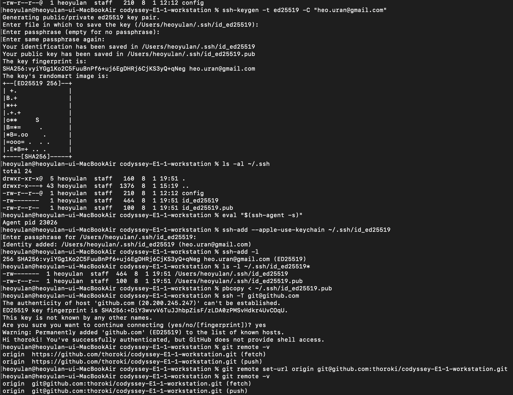
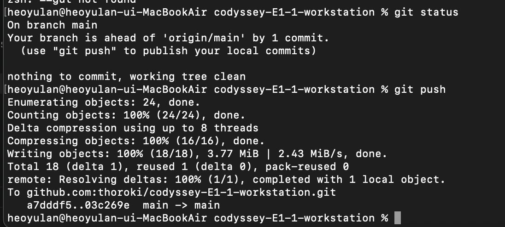


